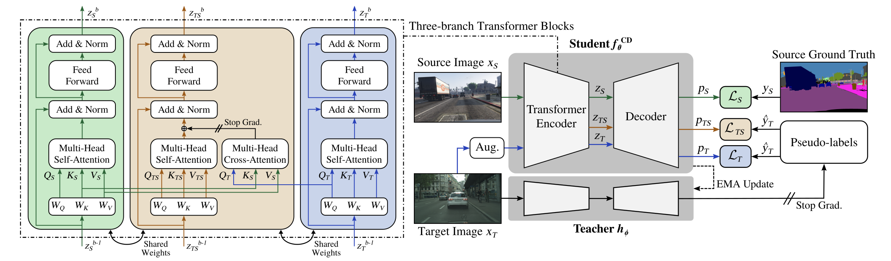

# Domain-Adaptive Semantic Segmentation with Memory-Efficient Cross-Domain Transformers

This repository contains the official implementation of the Unsupervised Domain Adaptation (UDA) framework for Semantic Segmentation described in:

Ruben Mascaro, Lucas Teixeira, and Margarita Chli. **Domain-Adaptive Semantic Segmentation with Memory-Efficient Cross-Domain Transformers**. *The British Machine Vision Conference (BMVC)*, 2023.

An overview of the proposed method is illustrated in the following diagram. For more details, please check our **[[Paper]](https://www.research-collection.ethz.ch/handle/20.500.11850/642496)** and **[[Video]](https://youtu.be/2-Zd34qA4CU)**.




## Environment Setup

This project relies on the [MIM](https://github.com/open-mmlab/mim) and the [MMSegmentation](https://github.com/open-mmlab/mmsegmentation) toolboxes. For the experiments in the paper, we specifically used [MMSegmentation v0.16.0](https://github.com/open-mmlab/mmsegmentation/tree/v0.16.0). Other requirements can be found in the `requirements.txt` file.

We recommend setting up a working conda environment as follows:

```shell
conda create -n memcdt python=3.8.5 pip=22.3.1
conda activate memcdt
pip install -r requirements.txt -f https://download.pytorch.org/whl/torch_stable.html
pip install mmcv-full==1.3.7 -f https://download.openmmlab.com/mmcv/dist/cu110/torch1.7/index.html
pip install openmim==0.1.5
pip install mmsegmentation==0.16.0
```

**Note**: The codebase should be compatible with newer versions of MMSegmentation (up to [v0.30.0](https://github.com/open-mmlab/mmsegmentation/tree/v0.30.0)). If not using [MMSegmentation v0.16.0](https://github.com/open-mmlab/mmsegmentation/tree/v0.16.0), please check for compatible versions of Pytorch, CUDA, MMCV and MIM. We note that using different versions of these libraries might lead to changes in performance.


## Data Preparation

We follow the same data preparation procedure as in [DAFormer](https://github.com/lhoyer/DAFormer).

**Cityscapes:** Please, download leftImg8bit_trainvaltest.zip and gt_trainvaltest.zip from [here](https://www.cityscapes-dataset.com/downloads/) and extract them to `data/cityscapes`.

**GTA:** Please, download all image and label packages from [here](https://download.visinf.tu-darmstadt.de/data/from_games/) and extract them to `data/gta`.

**Synthia (Optional):** Please, download SYNTHIA-RAND-CITYSCAPES from [here](http://synthia-dataset.net/downloads/) and extract it to `data/synthia`.

**ACDC (Optional):** Please, download rgb_anon_trainvaltest.zip and
gt_trainval.zip from [here](https://acdc.vision.ee.ethz.ch/download) and
extract them to `data/acdc`. Further, please restructure the folders from
`condition/split/sequence/` to `split/` using the following commands:

```shell
rsync -a data/acdc/rgb_anon/*/train/*/* data/acdc/rgb_anon/train/
rsync -a data/acdc/rgb_anon/*/val/*/* data/acdc/rgb_anon/val/
rsync -a data/acdc/gt/*/train/*/*_labelTrainIds.png data/acdc/gt/train/
rsync -a data/acdc/gt/*/val/*/*_labelTrainIds.png data/acdc/gt/val/
```

The final folder structure should look like this:

```none
MemCDT
├── ...
├── data
│   ├── acdc (optional)
│   │   ├── gt
│   │   │   ├── train
│   │   │   ├── val
│   │   ├── rgb_anon
│   │   │   ├── train
│   │   │   ├── val
│   ├── cityscapes
│   │   ├── leftImg8bit
│   │   │   ├── train
│   │   │   ├── val
│   │   ├── gtFine
│   │   │   ├── train
│   │   │   ├── val
│   ├── gta
│   │   ├── images
│   │   ├── labels
│   ├── synthia (optional)
│   │   ├── RGB
│   │   ├── GT
│   │   │   ├── LABELS
├── ...
```

**Data Preprocessing:** Finally, please run the following scripts to convert the label IDs to the train IDs and to generate the class index for the DAFormer Rare Class Sampling (RCS) strategy:

```shell
python tools/convert_datasets/gta.py data/gta --nproc 8
python tools/convert_datasets/cityscapes.py data/cityscapes --nproc 8
python tools/convert_datasets/synthia.py data/synthia/ --nproc 8
```


## Training

Please, download the MiT weights ([Google Drive](https://drive.google.com/drive/folders/1b7bwrInTW4VLEm27YawHOAMSMikga2Ia?usp=sharing) | [OneDrive](https://connecthkuhk-my.sharepoint.com/personal/xieenze_connect_hku_hk/_layouts/15/onedrive.aspx?id=%2Fpersonal%2Fxieenze%5Fconnect%5Fhku%5Fhk%2FDocuments%2Fsegformer%2Fpretrained%5Fmodels&ga=1)) pretrained on ImageNet-1K provided by the official [SegFormer repository](https://github.com/NVlabs/SegFormer) and put them in a folder `pretrained/` within this project. For the experiments in this work, only `mit_b5.pth` is necessary.

A training job can be launched using the `train.sh` script. The header of the file provides detailed instructions on how to use it.

**Example:** Train on GTA→Cityscapes using the proposed method (i.e. with the cross-domain *TS* branch enabled):

```shell
./tools/train.sh configs/daformer/gta2cityscapes/gta2cityscapes_dacs_daformer_mitb5_memtsbranch.py --seed 0 --work-dir /path/to/work_dir
```


## Evaluation

A trained model can be evaluated using the `test.sh` script. The header of the file provides detailed instructions on how to use it.

**Example:** Evaluate a model trained using the proposed method on GTA→Cityscapes:

```shell
./tools/test.sh configs/daformer/gta2cityscapes/gta2cityscapes_dacs_daformer_mitb5_memtsbranch.py /path/to/checkpoint_file --eval mIoU
```


## Trained Models

Our trained models for the three evaluated benchkmarks can be downloaded using the links below. Since the results in the paper are provided as the mean over three random seeds, here we provide the checkpoint with the median performance on the validation set.

* [MemCD(DAFormer) for GTA→Cityscapes](https://drive.google.com/file/d/165Rw8ZWdv5kSydohazJ36YMYryzL_ctR/view?usp=sharing)
* [MemCD(DAFormer) for Synthia→Cityscapes](https://drive.google.com/file/d/1CcBccteHV3ISXZsY9-417JSmAl3HSjuB/view?usp=sharing)
* [MemCD(DAFormer) for Cityscapes→ACDC](https://drive.google.com/file/d/1SCpA0m2OHLIdj73aE3u8MtSTm2bnTarF/view?usp=sharing)


## Acknowledgements

This project is based on the following open-source projects. We thank their
authors for making the source code publically available.

* [MMSegmentation](https://github.com/open-mmlab/mmsegmentation)
* [DAFormer](https://github.com/lhoyer/DAFormer)
* [DACS](https://github.com/vikolss/DACS)
* [SegFormer](https://github.com/NVlabs/SegFormer)


## License

This project is released under the [Apache License 2.0](LICENSE). However, some  specific features in this repository are with other licenses. Please carefully check [LICENSES.md](LICENSES.md) if you are using this code for commercial purposes.


## Citation

If you use this code in your academic work, please consider citing:
```
@inproceedings{mascaro2023memcdt,
  title={Domain-Adaptive Semantic Segmentation with Memory-Efficient Cross-Domain Transformers},
  author={Mascaro, Ruben and Teixeira, Lucas and Chli, Margarita},
  booktitle={The British Machine Vision Conference (BMVC)},
  year={2023}
}
```